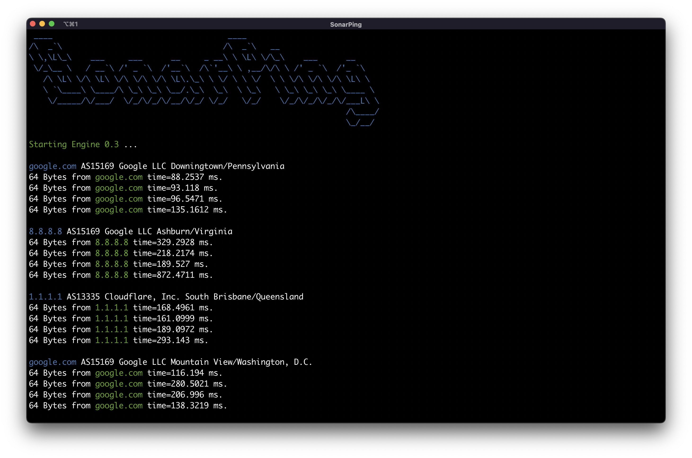

<div align="center"> <h1> SonarPing </h1>

[![Contributors][contributors-shield]][contributors-url]
[![Forks][forks-shield]][forks-url]
[![Stargazers][stars-shield]][stars-url]
[![Issues][issues-shield]][issues-url]

</div>

##  A Multi-Ping tool for sending ICMP requests



- [**Overview**](#overview)
- [**Usage**](#usage)
- [**Options**](#options)
- [**License**](#license)

## Overview

This tool allows sending ICMP requests for specific CIDR or multiple IPs with custom options.

It can use a CIDR file or a list of IPs in a file for sending ICMP_ECHO_REQUEST

Also, it uses multi-threading for sending requests

## How To Use
> SonarPing are rewritten ping protocol in python and becuase of that root privileges is required

### Ping Specific IP or Multiplie IPS :
```bash
sudo python3 SonarPing.py --ping google.com 8.8.8.8 1.1.1.1
```
```bash
sudo python3 SonarPing.py --file ips.txt
```
### Ping CIDR or CIDR File :
```bash
sudo python3 SonarPing.py --cidr 23.235.32.0/29
```
```bash
sudo python3 SonarPing.py --cidrfile ips.txt
```
### Note :
> Because there is no dependency for this script you can use curl directly to execute this script
```bash
https://raw.githubusercontent.com/SonyaCore/SonarPing/main/SonarPing.py | sudo python3 - --cidrfile ips.txt --delay 0.5
```

## Usage
|                |                               |
|----------------|-------------------------------|
|--file , -f     | `Send ICMP packets through IP file`   |
|--ping , -p     | `Send ICMP packets`                   |
|--cidr , -r     | `Send ICMP packets through CIDR range`|
|--cidrfile , -cf| `Send ICMP packets with CIDR file`    |

|                |                               |
|----------------|-------------------------------|
|--delay , -d    |`ICMP requests delay for sending each packet`            |
|--timeout , -t  |`ICMP request timeout`            |
|--count , -c    |`Stop current IP after sending (and receiving) count response packets`|
|--timeout , -t  |`ICMP request timeout`            |
|--bytes , -b    | `Total Bytes to be Send with ICMP header` |

## License
Licensed under the [GPL-3](LICENSE) license.

[contributors-shield]: https://img.shields.io/github/contributors/SonyaCore/SonarPing?style=flat&logo=appveyorg
[contributors-url]: https://github.com/SonyaCore/SonarPing/graphs/contributors
[forks-shield]: https://img.shields.io/github/forks/SonyaCore/SonarPing?style=flat&logo=appveyorg
[forks-url]: https://github.com/SonyaCore/SonarPing/network/members
[stars-shield]: https://img.shields.io/github/stars/SonyaCore/SonarPing?style=flat&logo=appveyorg
[stars-url]: https://github.com/SonyaCore/SonarPing/stargazers
[issues-shield]: https://img.shields.io/github/issues/SonyaCore/SonarPing?style=flat&logo=appveyorg
[issues-url]: https://github.com/SonyaCore/SonarPing/issues
[LICENSE]: https://www.gnu.org/licenses/gpl-3.0.en.html
